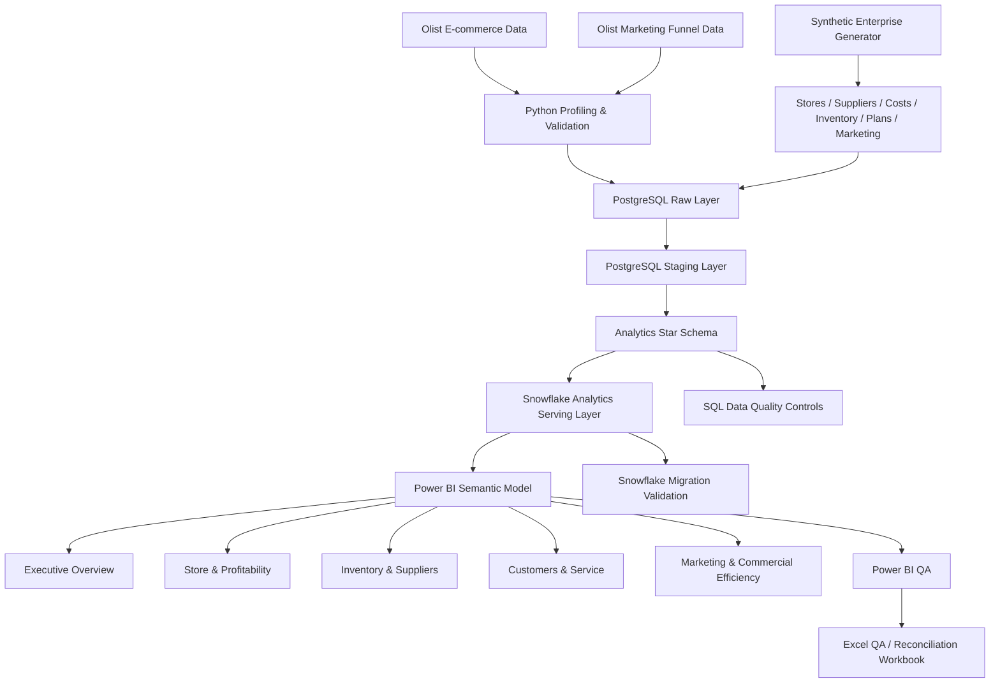
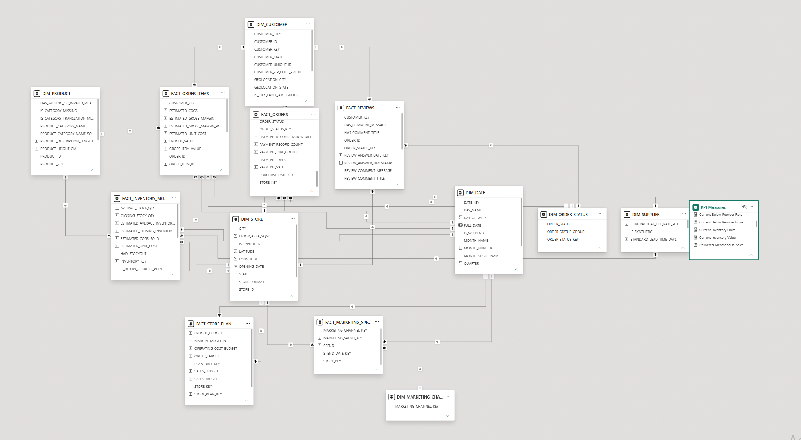
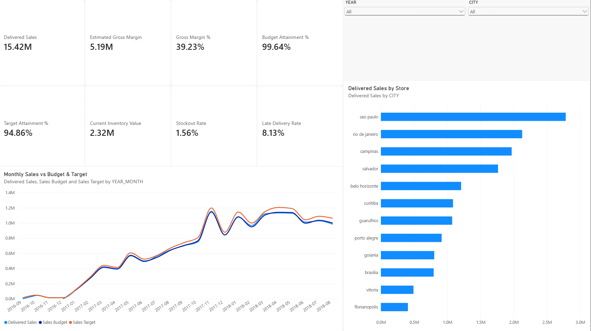
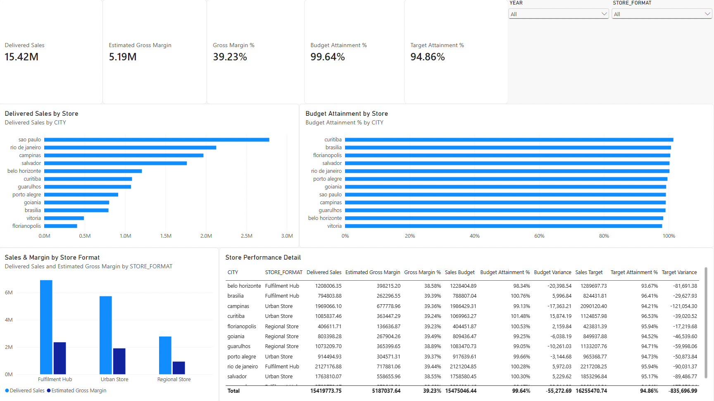
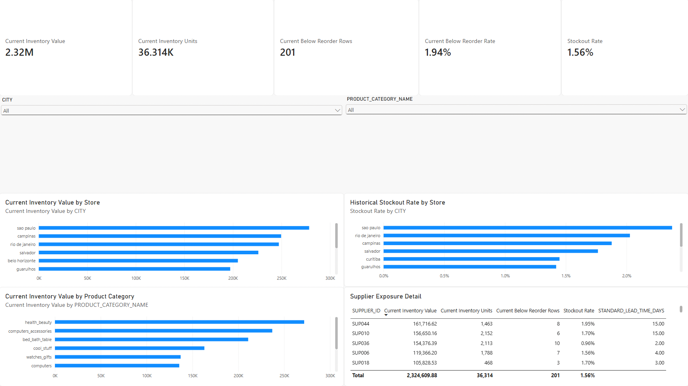
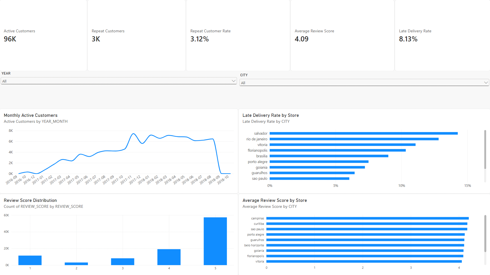
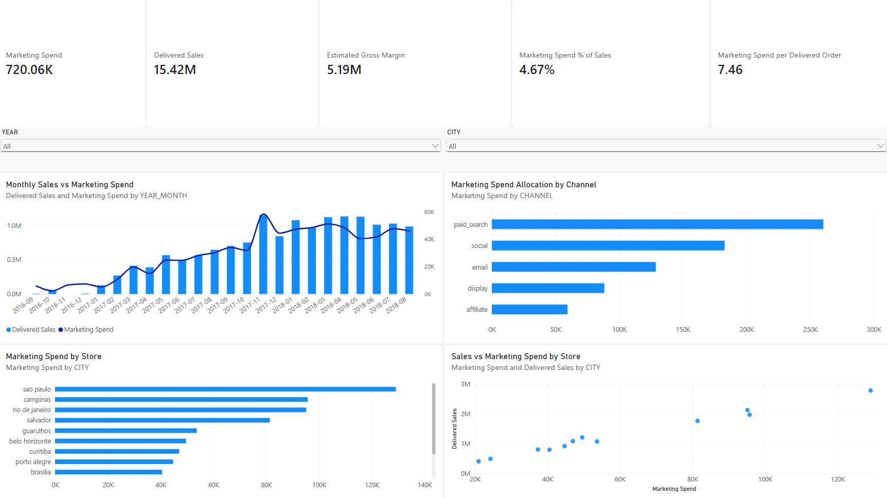

# End-to-End Retail & Operations Analytics Platform

An end-to-end analytics engineering and business intelligence portfolio project that transforms public Brazilian e-commerce data into an enterprise-style analytics platform using **Python, PostgreSQL, Snowflake, SQL, Power BI, and Excel**.

The project combines the public **Olist Brazilian E-Commerce** and marketing datasets with reproducibly generated enterprise operational data to support analysis across:

- sales and profitability
- store performance
- inventory and replenishment risk
- suppliers
- customers and service quality
- marketing and commercial efficiency

The final solution implements a layered warehouse architecture, cloud analytics serving layer, dimensional model, interactive Power BI report, and independent Excel reconciliation workbook.

---

## Project Overview

This project was designed to simulate the type of end-to-end analytics workflow performed by a Data Analyst, BI Analyst, Analytics Engineer, or Data Scientist working with operational business data.

The workflow covers:

```text
Raw Data
   ↓
Python Profiling & Validation
   ↓
PostgreSQL Raw Layer
   ↓
PostgreSQL Staging Layer
   ↓
Analytics Star Schema
   ↓
Snowflake Cloud Serving Layer
   ↓
Power BI Semantic Model
   ↓
Business Dashboards
   ↓
Excel QA & Reconciliation
```

The focus is not only dashboard creation. The project includes data quality controls, reproducible synthetic enterprise data, dimensional modeling, KPI definitions, warehouse validation, BI reconciliation, and business interpretation safeguards.

---

## Business Questions

The analytics platform supports questions such as:

- How much revenue is generated by delivered orders?
- Are stores meeting their sales budgets and targets?
- Which stores contribute the most sales and gross margin?
- What is the estimated gross margin of delivered merchandise?
- How much inventory is currently held across the modeled store network?
- Which stores and product categories carry the most inventory value?
- Where is inventory below reorder thresholds?
- How often have modeled inventory positions experienced stockouts?
- Which suppliers account for the largest inventory exposure?
- What proportion of customers purchase more than once?
- Which stores have the highest late-delivery rates?
- How do review scores differ across stores?
- How much modeled marketing spend is allocated across channels and stores?
- What relationship exists between marketing spend and delivered sales?

---

## Architecture



Detailed architecture documentation:

- [`docs/architecture/architecture.md`](docs/architecture/architecture.md)
- [`docs/architecture/star_schema.md`](docs/architecture/star_schema.md)

---

## Technology Stack

| Layer | Technology |
|---|---|
| Programming | Python 3.11 |
| Data processing | Pandas, NumPy |
| Visualization / analysis | Matplotlib |
| Local database | PostgreSQL |
| Cloud warehouse | Snowflake |
| Query language | SQL |
| BI / semantic model | Power BI Desktop |
| QA / reconciliation | Microsoft Excel |
| Development | VS Code |
| Version control | Git / GitHub |

---

## Data Sources

### Public data

The project uses the Olist Brazilian e-commerce dataset, including:

- customers
- orders
- order items
- payments
- reviews
- products
- sellers
- geolocation
- product-category translation
- marketing-qualified leads
- closed deals

Core source volumes include approximately:

- **99,441 orders**
- **99,441 customers**
- **112,650 order-item rows**
- **103,886 payment rows**
- **99,224 review rows**
- **32,951 products**

### Synthetic enterprise extensions

Public Olist data does not contain a complete enterprise operating model for store planning, supplier management, inventory replenishment, cost accounting, or marketing budgets.

To enable those analyses, this project reproducibly generates synthetic enterprise data including:

- 12 modeled stores
- 60 modeled suppliers
- product cost assumptions
- inventory snapshots
- reorder points
- stockout indicators
- sales budgets
- sales targets
- marketing spend
- channel allocation
- supplier operational attributes

> **Important:** These synthetic fields are portfolio extensions and must not be interpreted as observed Olist business metrics.

The synthetic design is documented in:

[`docs/business_requirements/synthetic_operations_design.md`](docs/business_requirements/synthetic_operations_design.md)

---

## Data Engineering Pipeline

### 1. Data profiling

`scripts/01_data_profiling.py`

Profiles the raw source files and records row counts, candidate keys, column characteristics, and other structural information.

### 2. Source-model audit

`scripts/02_source_model_audit.py`

Tests key relationships across the source model.

Core referential-integrity checks found **0% unmatched records** for major joins including:

- orders → customers
- order items → orders
- order items → products
- order items → sellers
- payments → orders
- reviews → orders

### 3. PostgreSQL ingestion

`scripts/03_load_raw_to_postgres.py`

Loads the public source files into the PostgreSQL raw layer.

### 4. Synthetic enterprise generation

`scripts/04_generate_synthetic_enterprise_data.py`

Reproducibly generates enterprise operational data for store, supplier, cost, inventory, budget, target, and marketing analysis.

### 5. Synthetic validation

`scripts/05_validate_synthetic_enterprise_data.py`

Validates generated enterprise data before warehouse ingestion.

### 6. Synthetic PostgreSQL ingestion

`scripts/06_load_synthetic_to_postgres.py`

Loads generated operational data into PostgreSQL.

### 7. Snowflake connectivity

`scripts/07_test_snowflake_connection.py`

Validates connectivity to the cloud warehouse.

### 8. Snowflake publication

`scripts/08_publish_analytics_to_snowflake.py`

Publishes the PostgreSQL analytics serving layer to Snowflake with explicit datatype mapping.

### 9. Snowflake migration validation

`scripts/09_validate_snowflake_migration.py`

Validates:

- table structure
- column compatibility
- datatypes
- NULL behavior
- row counts
- business-control totals

The final analytics layer contains **15 warehouse tables** and **661,470 rows** across the published model.

---

## Warehouse Design

The PostgreSQL implementation uses four logical schemas:

```text
raw
staging
analytics
synthetic
```

### Analytics dimensions

- `dim_customer`
- `dim_date`
- `dim_marketing_channel`
- `dim_order_status`
- `dim_product`
- `dim_seller`
- `dim_store`
- `dim_supplier`

### Analytics facts

- `fact_inventory_monthly`
- `fact_marketing_spend`
- `fact_order_items`
- `fact_orders`
- `fact_payments`
- `fact_reviews`
- `fact_store_plan`

The Power BI report uses a star-schema semantic model with single-direction dimension-to-fact relationships.



---

## Power BI Dashboard

The final report contains five stakeholder-facing pages.

### 1. Executive Overview

Provides headline commercial and operational KPIs:

- delivered sales
- estimated gross margin
- gross margin %
- budget attainment
- target attainment
- current inventory value
- stockout rate
- late-delivery rate



### 2. Store & Profitability

Analyses:

- store-level delivered sales
- estimated gross margin
- gross margin %
- budget attainment
- target attainment
- budget variance
- target variance
- performance by store format



### 3. Inventory & Suppliers

Analyses:

- current inventory value
- current inventory units
- below-reorder positions
- historical stockout rate
- inventory value by store
- inventory value by product category
- supplier inventory exposure
- supplier lead-time attributes



### 4. Customers & Service

Analyses:

- active customers
- repeat customers
- repeat customer rate
- average review score
- late-delivery rate
- monthly customer activity
- review-score distribution
- delivery performance by store
- review performance by store



### 5. Marketing & Commercial Efficiency

Analyses:

- marketing spend
- delivered sales
- estimated gross margin
- marketing spend as a percentage of sales
- marketing spend per delivered order
- marketing allocation by channel
- marketing spend by store
- relationship between store marketing spend and delivered sales



---

## Validated Business KPIs

| KPI | Validated Value |
|---|---:|
| Orders | 99,441 |
| Delivered Orders | 96,478 |
| Delivered Sales | 15,419,773.75 |
| Delivered Merchandise Sales | 13,221,498.11 |
| Estimated COGS | 8,034,460.47 |
| Estimated Gross Margin | 5,187,037.64 |
| Gross Margin | 39.23% |
| Sales Budget | 15,475,046.44 |
| Sales Target | 16,255,470.74 |
| Budget Attainment | 99.64% |
| Target Attainment | 94.86% |
| Late Delivery Rate | 8.13% |
| Historical Stockout Rate | 1.56% |
| Current Inventory Value | 2,324,609.88 |
| Current Inventory Units | 36,314 |
| Current Below-Reorder Rows | 201 |
| Current Below-Reorder Rate | 1.94% |
| Marketing Spend | 720,063.83 |
| Marketing Spend / Delivered Sales | 4.67% |
| Marketing Spend / Delivered Order | 7.46 |
| Active Customers | 96,096 |
| Repeat Customers | 2,997 |
| Repeat Customer Rate | 3.12% |
| Average Review Score | ~4.09 |

---

## Selected Business Findings

### Commercial performance

Delivered gross sales total approximately **15.42M** against a modeled sales budget of approximately **15.48M**, producing **99.64% budget attainment**.

Against the modeled sales target of approximately **16.26M**, attainment is **94.86%**.

Delivered merchandise generates approximately **5.19M estimated gross margin**, representing a modeled gross-margin rate of **39.23%**.

### Store concentration

The modeled São Paulo store has the largest delivered-sales contribution at approximately **2.78M**.

The three largest stores account for approximately **44.61%** of delivered sales, indicating material geographic concentration.

### Delivery and customer experience

The overall late-delivery rate is approximately **8.13%**.

Among modeled stores, Salvador and Rio de Janeiro exhibit relatively high late-delivery rates.

Orders delivered late have materially lower average review scores than on-time orders in the descriptive analysis. This is an **association**, not a causal estimate.

### Inventory

At the latest modeled snapshot:

- current closing inventory = **36,314 units**
- estimated inventory value = **2.32M**
- below-reorder rows = **201**
- below-reorder rate = **1.94%**

Across historical modeled inventory snapshots, the stockout-row rate is approximately **1.56%**.

### Customers

The model identifies:

- **96,096 active customers**
- **2,997 repeat customers**
- **3.12% repeat-customer rate**

### Marketing

Modeled marketing spend totals approximately **720K**, equal to approximately:

- **4.67% of delivered sales**
- **7.46 per delivered order**

Marketing channel charts show **spend allocation**, not channel-attributed revenue or causal return on advertising spend.

---

## Data Quality & Reconciliation

Data quality is treated as a separate project layer rather than an implicit assumption.

SQL controls are available under:

[`sql/quality/`](sql/quality/)

Checks include:

- primary/candidate-key evaluation
- source referential integrity
- staging validation
- payment reconciliation investigation
- analytics-model integrity
- enterprise-model validation
- date-dimension continuity
- Snowflake schema/type reconciliation
- Snowflake NULL validation
- business-total reconciliation

### Date-dimension repair

The analytics date dimension was tested for daily continuity.

Two missing dates were identified:

```text
2016-09-02
2016-09-03
```

After repair, the final date dimension contains:

```text
1,317 rows
2016-09-01 → 2020-04-09
0 missing dates
```

### PostgreSQL ↔ Snowflake

The final cloud publication validated:

```text
15 analytics tables
661,470 total analytics rows
column validation: PASS
datatype validation: PASS
NULL validation: PASS
business-total validation: PASS
```

### Power BI arithmetic QA

The final semantic-model QA independently confirmed:

```text
Repeat Customer Rate
= Repeat Customers / Active Customers
= 2,997 / 96,096
= 3.118756%
```

```text
Marketing Spend % of Sales
= 720,063.83 / 15,419,773.75
= 4.669743%
```

```text
Marketing Spend per Delivered Order
= 720,063.83 / 96,478
= 7.463503
```

All three QA difference tests returned exactly:

```text
0
```

---

## Excel QA / Reconciliation Workbook

An independent reconciliation workbook is included at:

[`excel/retail_operations_analytics_QA_reconciliation.xlsx`](excel/retail_operations_analytics_QA_reconciliation.xlsx)

It contains:

1. Executive Summary
2. KPI Reconciliation
3. Warehouse Validation
4. Data Quality Checks
5. Methodology & Assumptions

The workbook reconciles warehouse baselines with the Power BI semantic model and documents key methodology and synthetic-data assumptions.

---

## Power BI File

The completed Power BI report is available at:

[`powerbi/retail_operations_analytics.pbix`](powerbi/retail_operations_analytics.pbix)

The PBIX uses **Import mode** against the Snowflake analytics serving layer.

---

## Repository Structure

```text
retail-operations-analytics/
│
├── data/
│   ├── external/
│   ├── processed/
│   ├── raw/
│   └── synthetic/
│
├── docs/
│   ├── analysis/
│   ├── architecture/
│   ├── business_requirements/
│   ├── data_dictionary/
│   └── screenshots/
│
├── excel/
│   └── retail_operations_analytics_QA_reconciliation.xlsx
│
├── powerbi/
│   └── retail_operations_analytics.pbix
│
├── scripts/
│   ├── 01_data_profiling.py
│   ├── 02_source_model_audit.py
│   ├── 03_load_raw_to_postgres.py
│   ├── 04_generate_synthetic_enterprise_data.py
│   ├── 05_validate_synthetic_enterprise_data.py
│   ├── 06_load_synthetic_to_postgres.py
│   ├── 07_test_snowflake_connection.py
│   ├── 08_publish_analytics_to_snowflake.py
│   └── 09_validate_snowflake_migration.py
│
├── sql/
│   ├── analysis/
│   ├── analytics/
│   ├── quality/
│   ├── raw/
│   └── staging/
│
├── src/
│   ├── cleaning/
│   ├── ingestion/
│   ├── synthetic/
│   └── validation/
│
├── tests/
├── requirements.txt
└── README.md
```

---

## Reproduction Workflow

Create and activate a Python environment, install dependencies, and configure the PostgreSQL and Snowflake connection settings required by the scripts.

The pipeline is then executed in numerical order:

```bash
python scripts/01_data_profiling.py
python scripts/02_source_model_audit.py
python scripts/03_load_raw_to_postgres.py
python scripts/04_generate_synthetic_enterprise_data.py
python scripts/05_validate_synthetic_enterprise_data.py
python scripts/06_load_synthetic_to_postgres.py
python scripts/07_test_snowflake_connection.py
python scripts/08_publish_analytics_to_snowflake.py
python scripts/09_validate_snowflake_migration.py
```

Warehouse SQL is maintained under:

```text
sql/raw/
sql/staging/
sql/analytics/
sql/quality/
sql/analysis/
```

The Power BI report connects to the Snowflake analytics schema through a dedicated read-only BI user.

Credentials, tokens, private keys, and secrets are intentionally excluded from the repository.

---

## Interpretation & Limitations

This project intentionally combines public transactional data with synthetic enterprise operational extensions.

Therefore:

- store assignments are modeled
- supplier attributes are modeled
- cost and margin estimates are modeled
- inventory snapshots are modeled
- reorder thresholds are modeled
- budgets and targets are modeled
- marketing spend is modeled

These additions exist to demonstrate realistic enterprise analytics engineering and BI workflows.

They should **not** be represented as historical facts about Olist.

Additionally:

- late-delivery vs review comparisons are descriptive associations, not causal estimates
- marketing-spend vs sales comparisons are descriptive associations
- sales are not attributed to individual marketing channels
- supplier lead-time or fill-rate style attributes represent modeled assumptions rather than achieved supplier performance

---

## Project Outcome

This project demonstrates an end-to-end analytics workflow covering:

**data profiling → data engineering → SQL warehousing → dimensional modeling → cloud migration → data quality → business analysis → semantic modeling → dashboard development → reconciliation → documentation**

The result is a reproducible enterprise-style analytics platform rather than a standalone dashboard or notebook.
