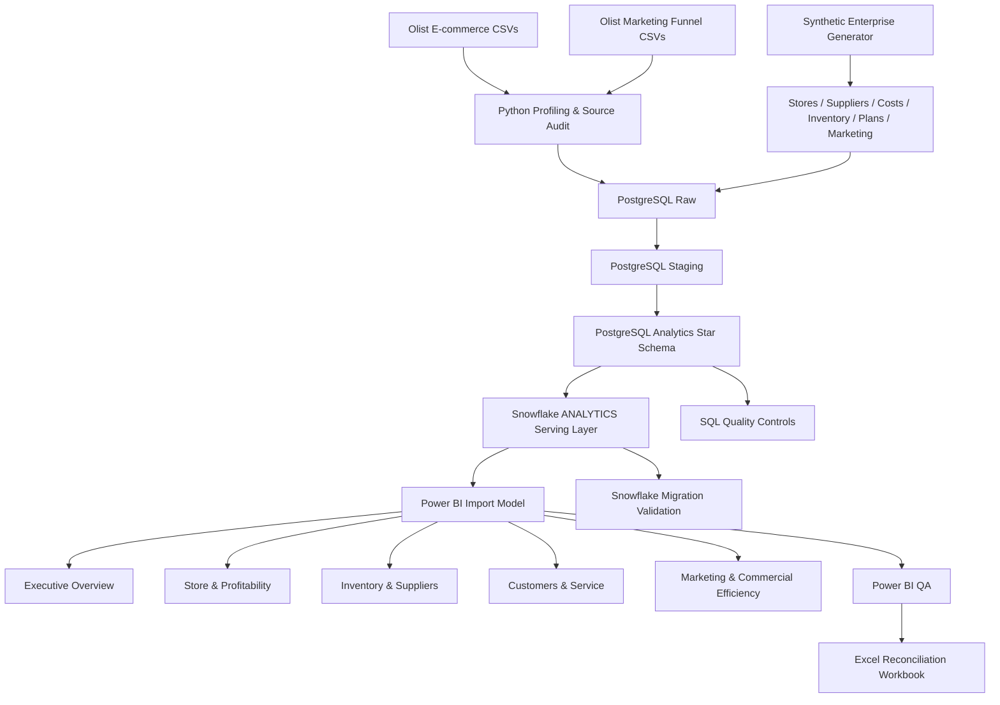
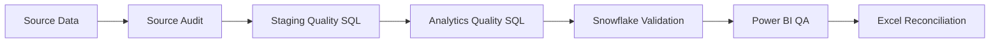

# Retail & Operations Analytics Architecture

## Overview

This project implements a layered analytics architecture that combines public Olist transactional data with reproducibly generated enterprise operational data.



---

## 1. Source Layer

### Public Olist data

The source model includes:

- customers
- orders
- order items
- payments
- reviews
- products
- sellers
- geolocation
- product-category translation
- marketing-qualified leads
- closed deals

Python profiling and source-model auditing are performed before warehouse ingestion.

---

## 2. Synthetic Enterprise Layer

Enterprise operational data is generated reproducibly to support analyses that are unavailable in the public source data.

The modeled layer includes:

- 12 stores
- 60 suppliers
- product cost assumptions
- supplier attributes
- monthly inventory
- reorder thresholds
- stockout indicators
- sales budgets
- sales targets
- marketing spend
- marketing channels

> These fields are synthetic portfolio extensions and must not be represented as observed Olist operating metrics.

---

## 3. PostgreSQL Layers

### Raw

Landing layer for public source files and generated enterprise data.

### Staging

Typed and validated relational representation of operational entities.

### Analytics

Dimensional serving model used for downstream BI and cloud publication.

### Synthetic

Dedicated schema for reproducibly generated enterprise operational data.

---

## 4. Dimensional Model

### Dimensions

```text
dim_customer
dim_date
dim_marketing_channel
dim_order_status
dim_product
dim_seller
dim_store
dim_supplier
```

### Facts

```text
fact_inventory_monthly
fact_marketing_spend
fact_order_items
fact_orders
fact_payments
fact_reviews
fact_store_plan
```

The Power BI semantic model uses active, single-direction dimension-to-fact relationships.

For detailed dimensional-model documentation, see:

[`star_schema.md`](star_schema.md)

---

## 5. Snowflake Serving Layer

The PostgreSQL analytics model is published to:

```text
Database: RETAIL_OPERATIONS_ANALYTICS
Schema:   ANALYTICS
```

The validated cloud serving layer contains:

```text
15 tables
661,470 rows
```

Migration controls validate:

- table structure
- column structure
- datatypes
- NULL behavior
- row counts
- business-control totals

---

## 6. Power BI Semantic Layer

Power BI Desktop uses Import mode against the Snowflake analytics schema.

The stakeholder-facing report contains five pages:

```text
1. Executive Overview
2. Store & Profitability
3. Inventory & Suppliers
4. Customers & Service
5. Marketing & Commercial Efficiency
```

A hidden QA page is retained for semantic-model validation.

The final semantic model is shown below:


---

## 7. Quality Architecture

Quality controls are applied at multiple layers.



Controls include:

- candidate-key and duplicate checks
- source referential integrity
- staging validation
- payment reconciliation investigation
- analytics-model integrity
- enterprise-model validation
- date-dimension continuity
- Snowflake column/type validation
- Snowflake NULL validation
- business-total reconciliation
- Power BI arithmetic checks

---

## 8. Date-Dimension Control

The analytics date dimension was tested for complete daily continuity.

Two missing dates were identified:

```text
2016-09-02
2016-09-03
```

After repair:

```text
minimum date: 2016-09-01
maximum date: 2020-04-09
rows:         1,317
missing days: 0
```

The corrected dimension was republished to Snowflake and refreshed in Power BI.

---

## 9. Reconciliation Layer

The independent Excel QA workbook is located at:

```text
excel/retail_operations_analytics_QA_reconciliation.xlsx
```

It contains:

- Executive Summary
- KPI Reconciliation
- Warehouse Validation
- Data Quality Checks
- Methodology & Assumptions

This provides traceability from warehouse outputs to the business-facing Power BI semantic model.

---

## 10. Interpretation Safeguards

The following enterprise fields are synthetic:

- stores
- suppliers
- supplier attributes
- product cost assumptions
- inventory positions
- reorder thresholds
- budgets
- targets
- marketing spend

Therefore, related outputs demonstrate analytics methodology rather than observed Olist operational performance.

Late-delivery/review-score analysis and marketing-spend/sales analysis are descriptive associations and must not be interpreted as causal relationships.
